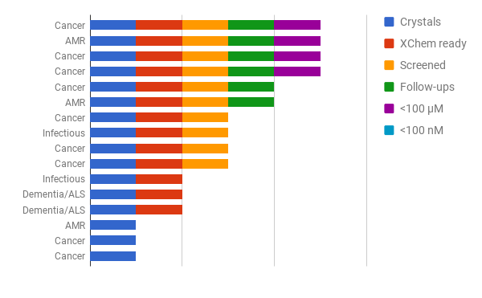

We have established a series of targets from across academia and are focussing on 8 targets from the following disease areas:
1. Anti-microbial resistance
2. Dementia / Alzheimers
3. Cancer
4. Infectious diseases

These will be screened by XChem and followed up on as part of Ox XChem. Progress so far below.

Binding and activity assays are needed to experimentally confirm the compounds synthesise bind and design the next round of SAR.
In this domain Ox XChem is developing collaborations with external groups to perform the required assays.

**If you're an assay group (e.g. SPR, NMR, AlphaScreen) and interested in working with us - please get in touch.**
