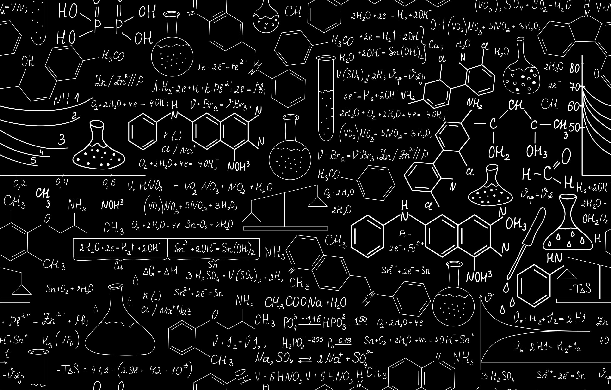
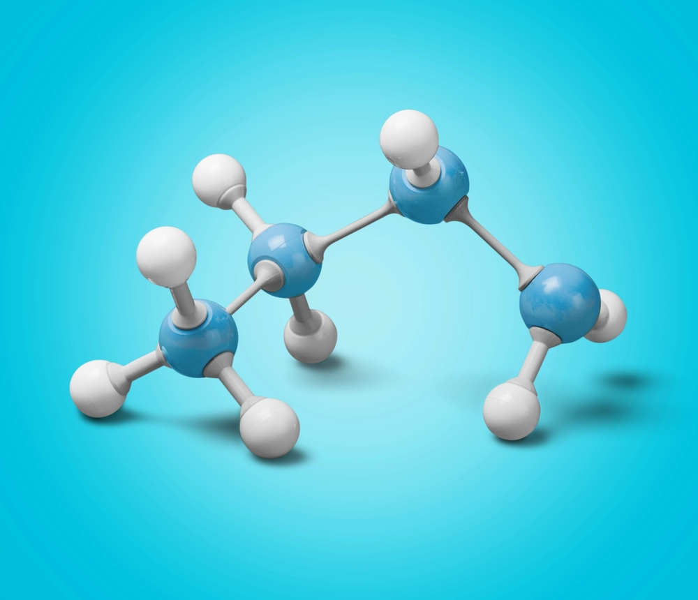

<section id="banner" class="style2">
   

      
      
      
      <header class="major">
         <h1>{{ page.description }}</h1>
      </header>
   

</section>
   

   

      <header class="major">
         <h1>Overview</h1>
      </header>
      {{ page.overview }}
   

   

   <section id="two" class="spotlights">
   

      <header class="major">
         <h3>Computational Chemistry</h3>
      </header>
      {{ page.compchem }}
      
   

   

      <header class="major">
         <h3>Synthetic Chemistry</h3>
      </header>
      {{ page.synchem }}
      
   

   </section>

